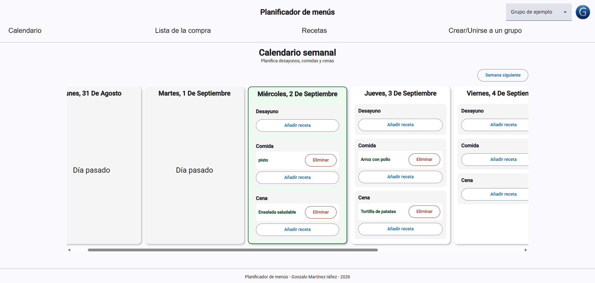
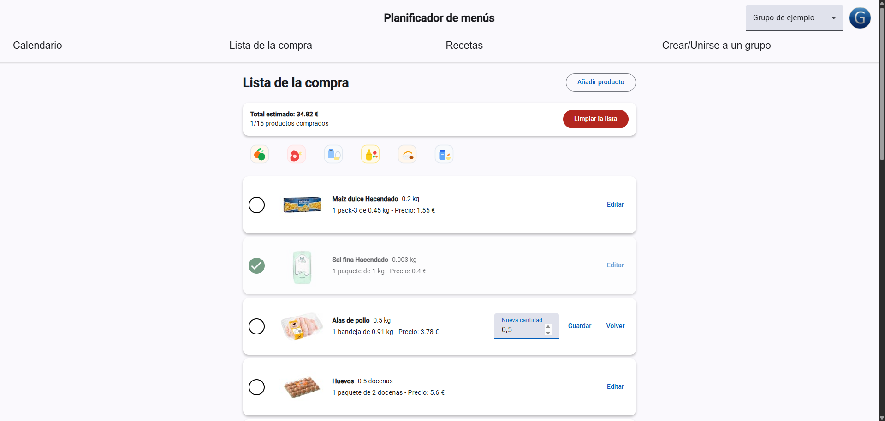
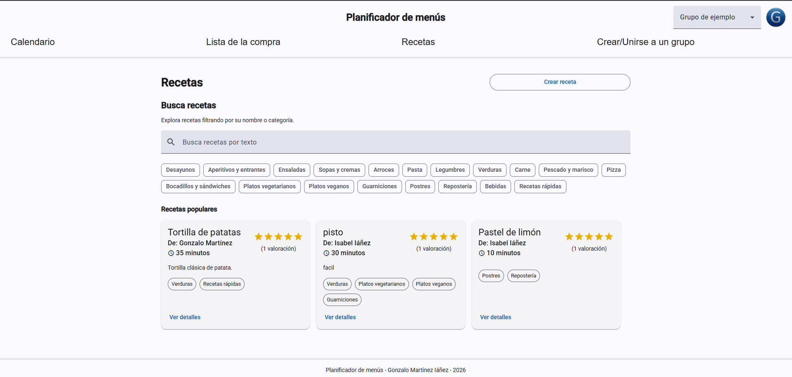
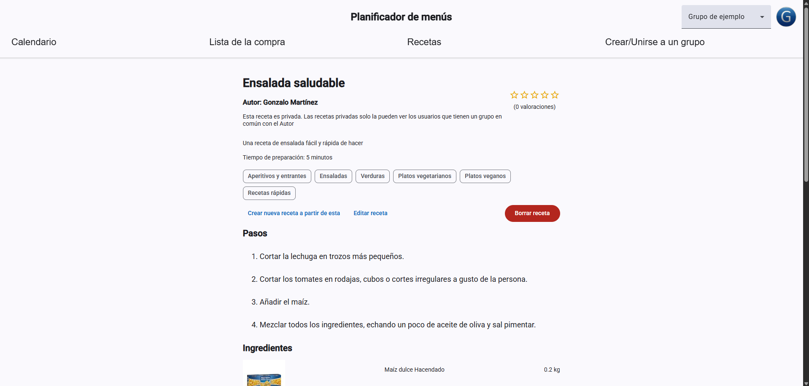
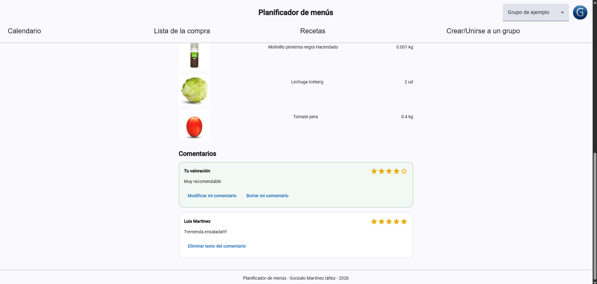
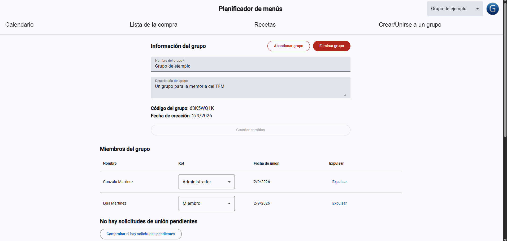
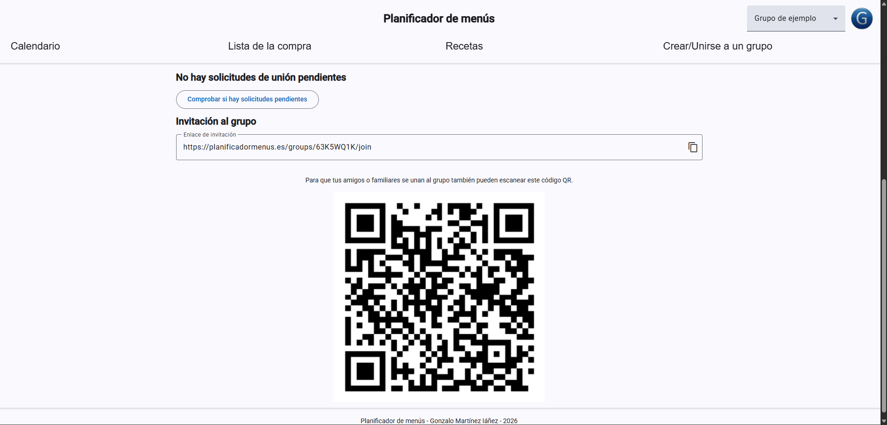

# Planificador de menús
## Gonzalo Martínez Iáñez

Aplicación web para planificar menús compartidos, guardar recetas y generar una lista de la compra para cada grupo.

Proyecto desarrollado como Trabajo Fin de Máster del Máster en Desarrollo de Aplicaciones Web de la Universidad Europea.

La aplicación está desplegada en https://planificadormenus.es/login.

## Funcionalidades

- Inicio de sesión con Google y autenticación mediante JWT.
- Creación, administración e invitación a grupos mediante enlace y código QR.
- Calendario semanal con desayuno, comida y cena.
- Lista de la compra generada a partir de las recetas del menú y editable manualmente.
- Buscador de recetas por nombre y categorías.
- Recetas públicas y privadas, con ingredientes, pasos, valoraciones y comentarios.

## Capturas

### Calendario semanal


### Lista de la compra 


### Buscador de recetas


### Recetas



### Administración de grupos 



## Tecnologías

- Frontend: Angular 21 y Angular Material.
- Backend: Django 6 y Django REST Framework.
- Autenticación: Google Identity Services y Simple JWT.
- Base de datos: SQLite en desarrollo y MySQL 8.4 en producción.
- Despliegue: Docker Compose, Nginx, Uvicorn y Let's Encrypt.
- CI/CD: GitHub Actions y GitHub Container Registry.

## Estructura

```text
PlanificadorMenus/
|- pmangular/     # Aplicación Angular
|- pmdjango/      # API Django
|- deploy/        # Inicialización de Let's Encrypt
|- IMG/           # Capturas de la aplicación
|- docker-compose.yml
|- .env.example
```

## Desarrollo local

Consulta las instrucciones concretas de cada aplicación:

- [Frontend Angular](pmangular/README.md)
- [Backend Django](pmdjango/README.md)

## Testing

```powershell
cd pmangular
npm test -- --watch=false

cd ..\pmdjango
python manage.py test
```

## Despliegue

El despliegue usa las imágenes publicadas en GitHub Container Registry al crear una etiqueta que comienza por `v`.

```powershell
git tag v1.0.0
git push origin v1.0.0
```

En el servidor, crea un archivo `.env` a partir de `.env.example`, indica las imágenes de la nueva etiqueta y ejecuta:

```sh
sudo docker compose pull
sudo docker compose up -d
```

En la primera ejecución, antes de levantar el stack HTTPS, ejecuta:

```sh
sudo sh deploy/init-letsencrypt.sh
```